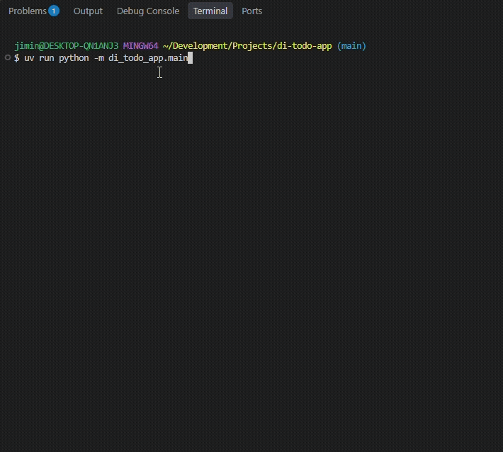

## Overview
This is a CLI application that allows you to manage all your to-do items:
- Group together related to-do items under to-do lists
- CRUD those lists and to-do items as you please

<p align="center">
  
</p>

## Requirements
* uv
* Python 3.12+

## Running the Application
0. Install all requirements and clone the repo.

1. Choose how your tasks should be stored by configuring `config.toml`. Follow the instructions there.
   
2. Run the app. From the root of the repo:
```
uv run python -m di_todo_app.main
```

## Usage
| Command | Description | Example |
|---------|-------------|---------|
| `list show [list_name]` | Show one or all todo lists. Use `*` for all lists, otherwise specify the list name. Displays list metadata, not the content (i.e. not the individual to-do items). | `list show groceries`  |
| `list get [list_name]` | Display all todo items of a todo list. | `list get groceries` |
| `list create [list_name]` | Create a new todo list. | `list create groceries` |
| `list update [list_name]` | Update a todo list. | `list update groceries` |
| `list delete [list_name]` | Delete one or all todo list(s). Specify `*` to delete all lists. | `list delete groceries` |
| `list clear [list_name]` | Clear the contents of a todo list. | `list clear groceries` |
| `todo add [list_name] [item_name]` | Add a todo item to a todo list. | `todo add groceries bananas` |
| `todo get [list_name] [item_id]` | Get a todo item from a todo list. | `todo get groceries 1` |
| `todo update [list_name] [item_id]` | Update a todo item from a todo list. | `todo update groceries 1` |
| `todo delete [list_name] [item_id]` | Delete a todo item from a todo list. | `todo delete groceries 1` |
